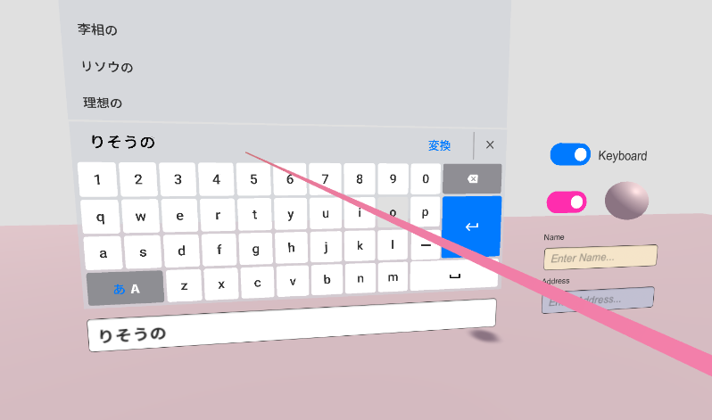
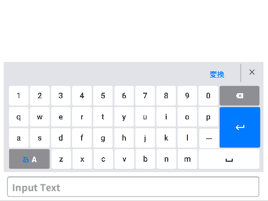
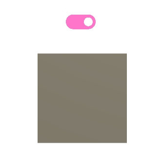

# VRUIPartsCollection

VR向けのUIパーツ集です。デスクトップ用2DUIとしても使用できます。

# 現在含まれるUIパーツ

## JapaneseEnglishKeyboard

QWERTY配列キーボードです。

PCのキーボードと同じように日本語と英語の切り替えができます。

 

## ToggleSwitch

シンプルなトグルスイッチです

 

# Tested Environment
* Windows10
* Unity2019.3.0f3 , Unity2019.2.19f1
  
Unity2018.Xでは動作しません。

# Third party assets

Keyboardを使う場合は以下のアセットを入れてください。

* UniRx

https://assetstore.unity.com/packages/tools/integration/unirx-reactive-extensions-for-unity-17276

* UniTask

https://github.com/Cysharp/UniTask

----------------------

このプロジェクトには以下のフォントが含まれています。

* NotoSansCJKjp-hinted

https://www.google.com/get/noto/help/cjk/

* Robot

https://fonts.google.com/specimen/Roboto

# ダウンロード

UnityPackage形式＆UnityProject形式で配布しています。

UnityPackageはGithubのReleaseから最新のものをダウンロードしてください。

すべてのUIパーツが入ったものと、各UIパーツ個別のUnityPackageがあります。

# Licence

このプロジェクトは、サードパーティのアセットを除き、[MIT License](LICENSE.md)でライセンスされています。

This project is licensed under the MIT License excluding third party assets.